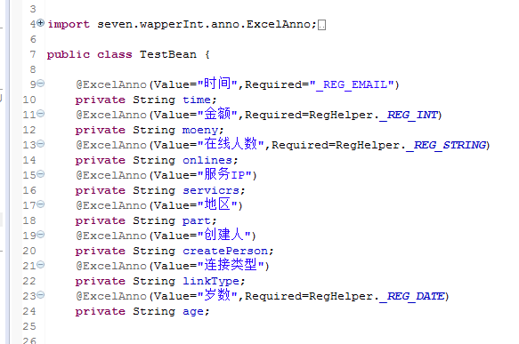
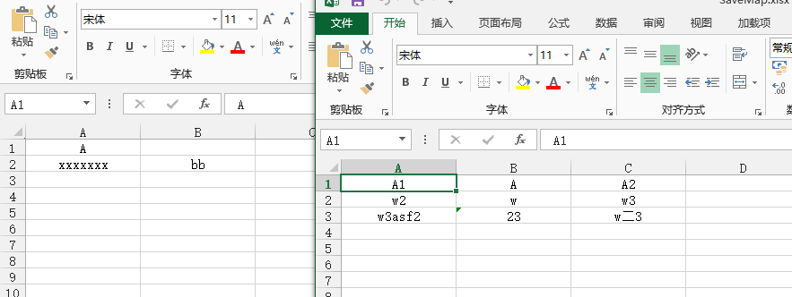

# ExcelReads(简单Excel通用读写器)
## ExcelReads是什么?
* 这是一个通用的简单的Excel读取器
* 支持自定义JavaBean实体读取和HashMap自动读取
* 支持自定义扩展
* 支持自定义Sheet范围，数据开始行数
* 支持数据库查询直接导出Excel(Map/Object)
* 支持正则过滤数据格式
* JavaBean实体支持使用注解添加正则规则校验，HashMap支持数组规则校验
* 依赖POI，使用Maven构建

## 更新纪录
### 更新2017/01/05
* 修复据库查询的导出(Object)递归越栈问题
* 增加新的xxx.Class定义类型导出，操作更简单
* 导出注解支持(自己使用seven.savewapper.anno.ExcelAnno类型注解)

### 更新2017/01/04
* 修复据库查询的导出(Map)空指针&下标越界问题
* 修复在Filter数据后出现空行问题
* 丢入Result参数后的操作就如同操作Map/Object一样

### 更新2017/01/01
* 增加ResExprotDBMap&ResExprotDBObj用于支持数据库导出
* 支持基于数据库查询的导出(Map),直接放入Result对象即可
* 支持基于数据库查询的导出(Object),直接放入Result对象即可

### 更新2016/11/30
* 增加了简单类型得写入，生成xls/xlsx
* 直接JavaBean类型写入，注解命名
* 支持Map key-value类型写入
* 写入时支持和读取一样得过滤加工排序等写法

### 更新2016/11/29
* 增加CreateMap By Key
* 去除无用泛型
* 增加xlsx支持

### 更新2016/11/8
* 支持数据过滤和处理是转换，基于事件模式
* 更新为Build模式创建实例
* 增加数据过滤、数据转换和数据排序回调接口
* 采用链式set方式进行


## 其他
* 自定义读取支持出简单的规范化数据格式，即典型的表头格式
* 可以继承 WapperMap 和 WapperObj进行扩展
* 直接使用ExcelFactory.getBeans进行获取，WapperObj则自己添加泛型
* 注解Value对应列标题，Required对应正则，可自己写正则表达式或者直接使用RegHelper
* 实体bean数据要比hashMap慢，7w条数据慢800ms，加入正则减慢速度(测试中加入了正则)

## 使用方法说明
1. 本程序只能读取简单格式的xls文件，文件布局如下（标准的行列结构）：<br>

| 标题1 | 标题2 | 标题3 |
|:-----:|:-----:|:-----:|
|foo    | foo   | foo   |
|bar    | bar   | bar   |
|baz    | baz   | baz   |


## 数据库导出自定义Bean类型写法（xxx.Class类型）
```java
ExcelFactory.saveExcel(
        UNPOOLED_DATA_SOURCE.getConnection().
                prepareStatement("select * FROM  users_info limit 1000").executeQuery(),
        "\u5317\u4eac__Excel.xlsx",
         AS.class)
    .FilterCol(() -> new String[]{"updatetime"})
    .Filter((AS o) ->o.getA().length() > 3)
    .Save();
```
## 数据库导出自定义Bean类型写法（自己实现包装）
```java
ExcelFactory.saveExcel(
        UNPOOLED_DATA_SOURCE.getConnection().
                prepareStatement("select * FROM  users_info limit 1000").executeQuery(),
        "\u5317\u4eac__Excel.xlsx",
            res -> {
                AS a = new AS();
                a.setA(res.getString("name"));
                return a;
            })
    .FilterCol(() -> new String[]{"updatetime"})
    .Filter((AS o) ->o.getA().length() > 3)
    .Save();
```
##  数据库直接导出到Excel例子
```java
ExcelFactory.saveExcel(
        UNPOOLED_DATA_SOURCE.getConnection().
                prepareStatement("select * FROM  users_info limit 10000").
                executeQuery(), "知乎导出Excel.xlsx")
        //过滤字段
   .FilterCol(() -> new String[]{"updatetime"})
        //过滤数据条件
   .Filter((HashMap<String, String> o) ->
            o.get("address").equals("\u5317\u4eac"))
   .Save();

```

## 自定义类型导出到Excel例子
```java
List<A> aa = new ArrayList<>();
aa.add(new A("a", "b"));
aa.add(new A("aa", "bb"));
ExcelFactory.saveExcel(aa,
    System.getProperty("user.dir").concat("\\Save.xlsx"))
        ///这里能够处理每一行数据
        .Process((A a) -> a.setA("xxxxxxx"))
        //过滤列
        .FilterCol(() -> new String[]{"B"})
        //根据某个字段来处理数据时候丢弃
        .Filter((A a) -> a.getA().length() > 1)
        //排序
        .Sort((A o1,A o2 ) -> o1.getAge()>o2.getAge()?1:o1.getAge()==o2.getAge()?0:-1)
        .Save();
```
## 读取Excel到Map例子
```java
 List<Map<String,String>> data=ExcelFactory.getBeans(System.getProperty("user.dir").concat("\\测试.xls"),
                new ResWrapperMap() {
                    @Override//配置Excel属性
                    protected void LoadConfig(Config config) {
                        config.setContent_row_start(3);
                        config.setTitle_row(2);
                    }
                }).//这里能够处理每一行数据
                Process((HashMap<String, String> o) -> System.out.println(o + "\n")
                //这里能够处理时候过滤某一列
                ).FilterCol(() -> new String[]{}
                //这里能根据某一行的某一列的内容来取舍这行数据
        ).Filter((HashMap<String, String> o) -> o.get("创建人") != null && o.get("创建人").length() > 5
                //排序
        ).Sort((o1, o2) -> o1.hashCode()>o2.hashCode()?1:hashCode()==o2.hashCode()?0:-1).Create();

//使用 .CreateMap(key_v) 生成Map<Key,Map>类型数据

```
## 读取Excel到自定义类型的例子

```java
Map<String,Seven> map=new ResWrapperObj(Seven) {
                    @Override
                    protected void LoadConfig(Config config) {
                        config.setContent_row_start(3);
                        config.setTitle_row(2);
                    }
                }).
                Process((HashMap<String, String> o) -> {}
                ).FilterCol(() -> new String[]{}
        ).Filter((HashMap<String, String> o) -> o.get("创建人") != 
        null &&o.get("创建人").length() > 4).<Map>CreateMap("创建人"));
```
 ## 效果

## 实体类截图

## 继承关系

## 引用关系

## 写入效果


* 邮件(hacker.kill07@gmail.com)
* QQ: 985390927
* weibo: [@Alden_情绪控](http://weibo.com/Sweets07)
* Blog: [http://sweets.cf](http://sweets.cf)